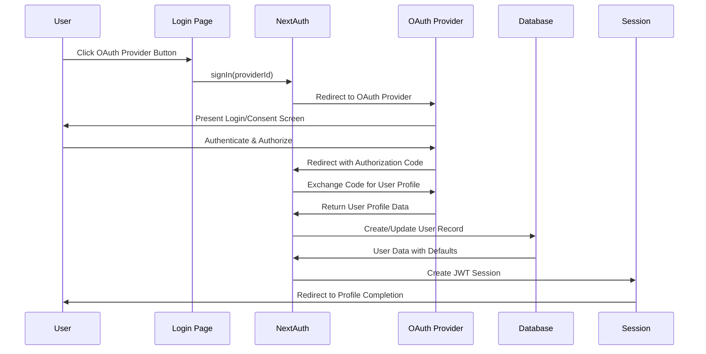

The Everybody Eats Volunteer Portal implements a comprehensive OAuth authentication system using NextAuth.js, supporting multiple providers alongside traditional credential-based authentication.

## Architecture Overview

### Authentication Stack

- **NextAuth.js v4**: Session management and OAuth provider integration
- **JWT Strategy**: Stateless session handling with encrypted tokens
- **Multi-Provider Support**: Google, Facebook, and Apple OAuth providers
- **Profile Completion Flow**: Post-OAuth user onboarding for volunteer-specific data

### Core Components

| Component | Location | Purpose |
|-----------|----------|---------|
| `auth-options.ts` | `/src/lib/auth-options.ts` | NextAuth configuration and provider setup |
| `login/page.tsx` | `/src/app/login/page.tsx` | Authentication UI with OAuth buttons |
| `[...nextauth].ts` | `/src/app/api/auth/[...nextauth]/route.ts` | NextAuth API route handler |

## OAuth Provider Configuration

### Supported Providers

The system currently supports three OAuth providers with customized configurations:

#### Google OAuth
```typescript
GoogleProvider({
  clientId: process.env.GOOGLE_CLIENT_ID!,
  clientSecret: process.env.GOOGLE_CLIENT_SECRET!,
  profile(profile) {
    return {
      id: profile.sub,
      name: profile.name,
      email: profile.email,
      // Request higher quality image (400x400)
      image: profile.picture?.replace(/=s\d+-c$/, "=s400-c") || profile.picture,
    };
  },
})
```

#### Facebook OAuth
```typescript
FacebookProvider({
  clientId: process.env.FACEBOOK_CLIENT_ID!,
  clientSecret: process.env.FACEBOOK_CLIENT_SECRET!,
  // Request highest quality profile picture (800x800)
  profileUrl: "https://graph.facebook.com/me?fields=id,name,email,picture.width(800).height(800)",
  profile(profile: FacebookProfile) {
    return {
      id: profile.id,
      name: profile.name,
      email: profile.email,
      image: profile.picture?.data?.url,
    };
  },
})
```

#### Apple OAuth

⚠️ **Requires paid Apple Developer Account** ($99/year USD)

```typescript
// Apple provider configuration in environment variables
// Requires more complex setup with certificates and JWT generation
APPLE_ID="your-apple-app-id"
APPLE_SECRET="your-apple-secret" // Generated JWT token
```

**Cost Considerations**:
- Apple Developer Program membership required: $99/year USD
- Both Individual and Organization memberships cost the same
- Free alternatives: Google and Facebook OAuth are free to implement

### Required Environment Variables

```bash
# NextAuth Core
NEXTAUTH_URL="http://localhost:3000"
NEXTAUTH_SECRET="your-secret-here"

# Google OAuth
GOOGLE_CLIENT_ID="your-google-client-id"
GOOGLE_CLIENT_SECRET="your-google-client-secret"

# Facebook OAuth
FACEBOOK_CLIENT_ID="your-facebook-client-id"
FACEBOOK_CLIENT_SECRET="your-facebook-client-secret"

# Apple OAuth
APPLE_ID="your-apple-app-id"
APPLE_SECRET="your-apple-secret"
```

## Authentication Flow

### OAuth Sign-In Process



### Step-by-Step Flow

1. **Provider Selection**: User clicks OAuth provider button in login UI
2. **OAuth Redirect**: NextAuth redirects to provider's authorization server
3. **Provider Authentication**: User authenticates with OAuth provider
4. **Callback Processing**: Provider redirects back with authorization code
5. **User Creation/Update**: System creates or updates user in database
6. **Session Establishment**: JWT token created with user data
7. **Profile Completion**: OAuth users redirected to complete volunteer profile

### Database User Creation

When an OAuth user signs in for the first time:

```typescript
// New user creation in signIn callback
const existingUser = await prisma.user.create({
  data: {
    email: user.email,
    name: user.name || "",
    firstName: nameParts[0] || "",
    lastName: nameParts.slice(1).join(" ") || "",
    role: "VOLUNTEER", // Default role for OAuth users
    profilePhotoUrl: user.image || null,
    hashedPassword: "", // OAuth users don't need passwords
    volunteerAgreementAccepted: false, // Must complete profile
    healthSafetyPolicyAccepted: false,
  },
});
```

### Profile Completion Flow

OAuth users are automatically redirected to `/profile/edit?oauth=true` to complete:
- Emergency contact information
- Medical conditions and dietary restrictions
- Availability preferences
- Policy agreement acceptance

## Session Management

### JWT Token Structure

The JWT token includes extended user information:

```typescript
interface JWT {
  role?: "ADMIN" | "VOLUNTEER";
  phone?: string | null;
  firstName?: string | null;
  lastName?: string | null;
}
```

### Session Object

Client-side session includes:

```typescript
interface Session {
  user: {
    id?: string;
    email?: string;
    name?: string;
    image?: string;
    role?: "ADMIN" | "VOLUNTEER";
    phone?: string;
    firstName?: string;
    lastName?: string;
  }
}
```

### Session Updates

Profile changes trigger session updates using the `update` trigger:

```typescript
// In profile update components
import { useSession } from "next-auth/react";
const { update } = useSession();

// After profile update
await update(); // Refreshes session with latest database data
```

## Frontend Implementation

### OAuth Button Rendering

The login page dynamically renders OAuth provider buttons:

```typescript
// Get available providers
const providers = await getProviders();
const oauthProviders = Object.values(providers).filter(
  (provider) => provider.type === "oauth"
);

// Handle OAuth sign-in
async function handleOAuthSignIn(providerId: string) {
  await signIn(providerId, {
    callbackUrl: "/dashboard",
  });
}
```

### Provider-Specific Styling

Each OAuth provider has custom styling and icons:

```typescript
const getProviderButtonStyle = (providerId: string) => {
  switch (providerId) {
    case "google":
      return "bg-white hover:bg-gray-50 text-gray-900 border border-gray-300";
    case "facebook":
      return "bg-[#1877F2] hover:bg-[#166FE5] text-white";
    case "apple":
      return "bg-black hover:bg-gray-900 text-white";
  }
};
```

## Security Considerations

### CSRF Protection

NextAuth.js provides built-in CSRF protection for all authentication flows.

### Secure Callbacks

OAuth callback URLs are validated and must match configured domains:

```typescript
// Development
http://localhost:3000/api/auth/callback/[provider]

// Production  
https://yourdomain.com/api/auth/callback/[provider]
```

### Profile Photo Security

OAuth profile photos are stored as URLs, not downloaded files, reducing security risks while providing high-quality images.

## Error Handling

### OAuth Flow Errors

```typescript
try {
  await signIn(providerId, { callbackUrl: "/dashboard" });
} catch (error) {
  console.error("OAuth sign in error:", error);
  setError("Authentication failed. Please try again.");
}
```

### Database Errors

OAuth sign-in callback includes comprehensive error handling:

```typescript
try {
  // User creation/update logic
} catch (error) {
  console.error("Error handling OAuth sign-in:", error);
  return false; // Prevents sign-in
}
```

## Testing OAuth Integration

### Local Development

1. Configure OAuth providers with localhost callback URLs
2. Set environment variables in `.env.local`
3. Test each provider's authentication flow
4. Verify profile completion redirect works

### End-to-End Testing

OAuth flows are tested using Playwright with provider-specific test accounts:

```typescript
// Test OAuth button presence
await expect(page.getByTestId('oauth-google-button')).toBeVisible();
await expect(page.getByTestId('oauth-facebook-button')).toBeVisible();

// Test OAuth provider separation from credentials
await expect(page.getByTestId('oauth-divider')).toBeVisible();
```

## Extending OAuth Providers

### Adding New Providers

1. **Install Provider**: Add NextAuth provider package
```bash
npm install @auth/[provider-name]
```

2. **Configure Provider**: Add to `auth-options.ts`
```typescript
import ProviderName from "next-auth/providers/provider-name";

providers: [
  ProviderName({
    clientId: process.env.PROVIDER_CLIENT_ID!,
    clientSecret: process.env.PROVIDER_CLIENT_SECRET!,
  }),
  // ... existing providers
]
```

3. **Update UI**: Add provider button to login page
4. **Add Environment Variables**: Include in `.env.local` and deployment
5. **Configure Callback URLs**: Set in provider dashboard

### Custom Profile Mapping

Override the default profile mapping to extract additional data:

```typescript
ProviderName({
  // ... config
  profile(profile) {
    return {
      id: profile.id,
      name: profile.display_name,
      email: profile.email,
      image: profile.avatar_url,
      // Custom fields
      customField: profile.custom_data,
    };
  },
})
```

## Troubleshooting

### Common Issues

| Issue | Solution |
|-------|----------|
| "Invalid redirect URI" | Verify callback URLs match provider configuration exactly |
| "App not in development mode" | Some providers require app review for production |
| "OAuth provider not appearing" | Check environment variables and provider configuration |
| "Profile completion not triggering" | Verify `volunteerAgreementAccepted` is false for OAuth users |
| "Apple OAuth setup failing" | Ensure you have a paid Apple Developer account ($99/year) and proper certificates |

### Debug Mode

Enable NextAuth debugging in development:

```bash
NEXTAUTH_DEBUG=true npm run dev
```

### Provider-Specific Testing

Test each provider independently by temporarily disabling others in the configuration.

---

This OAuth authentication system provides a secure, user-friendly way for volunteers to join the platform while maintaining the flexibility to add additional providers or customize the authentication flow as needed.