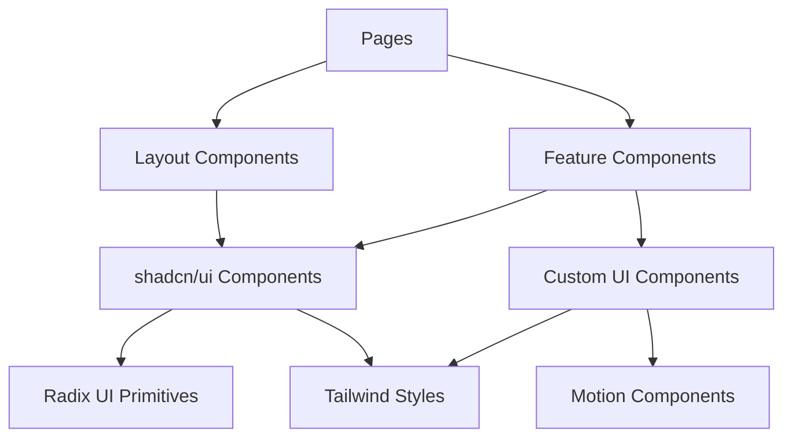
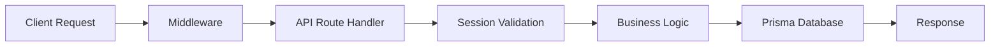
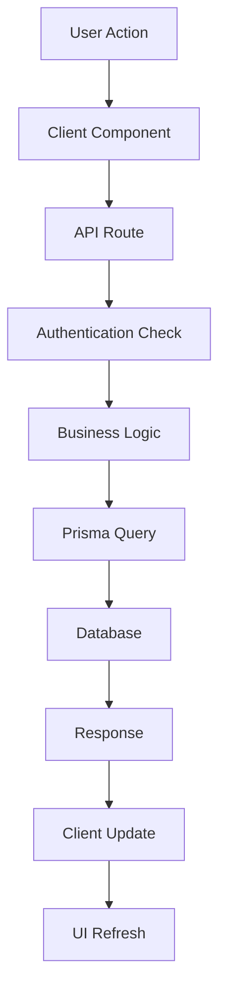

The Everybody Eats Volunteer Portal is built with modern web technologies, prioritizing developer experience, performance, and maintainability.

## Frontend Stack

### Core Framework

**[Next.js 15.4](https://nextjs.org/)** with App Router
- **Why**: Server-side rendering, excellent developer experience, and powerful routing
- **Features Used**: App Router, Server Components, API routes, middleware
- **File Structure**: `/src/app/` for pages and API routes
- **Documentation**: [Next.js Docs](https://nextjs.org/docs)

**[TypeScript](https://www.typescriptlang.org/)** with Strict Configuration
- **Why**: Type safety, better developer experience, and reduced runtime errors
- **Configuration**: Strict mode enabled for maximum type safety
- **Integration**: Full TypeScript support across the entire codebase
- **Documentation**: [TypeScript Handbook](https://www.typescriptlang.org/docs/)

### UI & Styling

**[Tailwind CSS v4](https://tailwindcss.com/)**
- **Why**: Utility-first CSS framework for rapid development
- **Configuration**: Custom design system with consistent spacing, colors, and typography
- **Components**: Integrated with shadcn/ui component library
- **Documentation**: [Tailwind CSS Docs](https://tailwindcss.com/docs)

**[shadcn/ui Components](https://ui.shadcn.com/)**
- **Why**: High-quality, accessible, and customizable React components
- **Location**: `/src/components/ui/` directory
- **Features**: Built on [Radix UI](https://www.radix-ui.com/) primitives with Tailwind styling
- **Documentation**: [shadcn/ui Docs](https://ui.shadcn.com/docs) | [Radix UI Docs](https://www.radix-ui.com/primitives/docs/overview/introduction)

**[Motion.dev](https://motion.dev/)**
- **Why**: Performant animations with better developer experience than CSS animations
- **Migration**: Migrated from CSS animations and tw-animate-css
- **Location**: Animation utilities in `/src/lib/motion.ts`
- **Documentation**: [Motion.dev Docs](https://motion.dev/docs)

### UI Component Architecture

## Backend Stack

### Authentication

**[NextAuth.js v4](https://next-auth.js.org/)**
- **Why**: Complete authentication solution with multiple provider support
- **Providers**: Google, Facebook, Apple OAuth + credential-based auth
- **Session**: JWT strategy for stateless authentication
- **Configuration**: `/src/lib/auth-options.ts`
- **Documentation**: [NextAuth.js Docs](https://next-auth.js.org/getting-started/introduction)

### Database

**[PostgreSQL](https://www.postgresql.org/)**
- **Why**: Robust relational database with excellent performance and ACID compliance
- **Hosting**: Production deployment on managed PostgreSQL service
- **Features**: Complex relationships, transactions, and data integrity
- **Documentation**: [PostgreSQL Docs](https://www.postgresql.org/docs/)

**[Prisma ORM](https://www.prisma.io/)**
- **Why**: Type-safe database access with excellent developer experience
- **Schema**: `/prisma/schema.prisma` with automated migrations
- **Client**: Generated TypeScript client for type-safe queries
- **Tools**: Prisma Studio for database visualization
- **Documentation**: [Prisma Docs](https://www.prisma.io/docs)

### API Architecture

**Next.js App Router API Routes**
- **Structure**: RESTful API design in `/src/app/api/`
- **Authentication**: Session-based protection with role checking
- **Error Handling**: Consistent error responses and logging

## Development Tools

### Testing

**[Playwright](https://playwright.dev/)** for End-to-End Testing
- **Why**: Reliable, fast, and cross-browser testing
- **Location**: `/tests/e2e/` directory
- **Strategy**: Comprehensive user journey testing
- **CI Integration**: Automated testing in Chromium for faster feedback
- **Documentation**: [Playwright Docs](https://playwright.dev/docs/intro)

### Code Quality

**[ESLint](https://eslint.org/)** with Next.js Configuration
- **Why**: Consistent code style and catching common errors
- **Configuration**: Extended from Next.js recommended rules
- **Integration**: Pre-commit hooks and CI pipeline
- **Documentation**: [ESLint Docs](https://eslint.org/docs/latest/)

**TypeScript Compiler**
- **Why**: Type checking and early error detection
- **Command**: `npm run typecheck`
- **Configuration**: Strict mode for maximum type safety

### Development Workflow

**Hot Module Replacement (HMR)**
- **Framework**: Built into Next.js development server
- **Speed**: Instant feedback during development
- **Reliability**: Preserves application state during updates

## Deployment & Infrastructure

### Build System

**Next.js Build Pipeline**
- **Static Generation**: Pre-rendered pages for better performance
- **Code Splitting**: Automatic bundle optimization
- **Image Optimization**: Built-in image optimization and lazy loading

### Environment Management

**Multi-Environment Configuration**
- **Development**: Local development with `.env.local`
- **Production**: Environment variables for sensitive configuration
- **Database**: Separate database instances per environment

## Documentation Stack

### Documentation Site

**[Astro](https://astro.build/)** with [Starlight](https://starlight.astro.build/) Theme
- **Why**: Fast, content-focused static site generator
- **Theme**: Starlight for beautiful documentation sites
- **Location**: `/docs/` directory
- **Documentation**: [Astro Docs](https://docs.astro.build/) | [Starlight Docs](https://starlight.astro.build/)

**Plugins**
- **[starlight-sidebar-topics](https://github.com/HiDeoo/starlight-sidebar-topics)**: Advanced sidebar navigation
- **[astro-mermaid](https://github.com/remcohaszing/astro-mermaid)**: Interactive diagram support

### Content Management

**[Markdown](https://commonmark.org/)** with Frontmatter
- **Format**: `.md` and `.mdx` files for documentation
- **Structure**: Organized by user role (admin, developers, managers)
- **Features**: Code highlighting, interactive examples
- **Specification**: [CommonMark](https://commonmark.org/) | [MDX](https://mdxjs.com/)

## Architecture Patterns

### Design Patterns

**Component Composition**
- **Pattern**: Composable React components with clear interfaces
- **Benefits**: Reusability, maintainability, and consistent design

**Server Components**
- **Usage**: Data fetching and initial rendering on the server
- **Benefits**: Improved performance and SEO

**API-First Design**
- **Structure**: Clear separation between frontend and backend logic
- **Benefits**: Testability and potential for mobile app integration

### Data Flow

## Key Features Implementation

### Real-time Features

**Optimistic Updates**
- **Pattern**: Immediate UI updates with server reconciliation
- **Implementation**: Custom hooks for common operations
- **Fallback**: Error handling and rollback mechanisms

### Security

**Role-Based Access Control (RBAC)**
- **Roles**: ADMIN and VOLUNTEER with different permissions
- **Implementation**: Session-based role checking
- **Protection**: API route and component-level access control

**Data Validation**
- **Client-Side**: Form validation with immediate feedback
- **Server-Side**: Schema validation on all API endpoints
- **Sanitization**: Input sanitization to prevent XSS attacks

## Performance Considerations

### Optimization Strategies

**Code Splitting**
- **Automatic**: Next.js automatic code splitting by route
- **Manual**: Dynamic imports for heavy components
- **Result**: Faster initial page loads

**Caching**
- **Static Assets**: CDN caching for static resources
- **Database**: Prisma query optimization and connection pooling
- **Client**: Browser caching for API responses

**Image Optimization**
- **Next.js Image Component**: Automatic WebP conversion and lazy loading
- **Responsive Images**: Multiple sizes for different screen resolutions
- **Profile Photos**: High-quality OAuth provider images

## Development Commands

| Command | Purpose |
|---------|---------|
| `npm run dev` | Start development server |
| `npm run build` | Build production bundle |
| `npm run lint` | Run ESLint |
| `npm run typecheck` | TypeScript type checking |
| `npm run test:e2e` | Run Playwright tests |
| `npm run prisma:generate` | Generate Prisma client |
| `npm run prisma:migrate` | Run database migrations |

## Versioning & Releases

**Semantic Versioning**
- **Automation**: GitHub Actions for automated versioning
- **Labels**: PR labels control version bumps (major/minor/patch)
- **Changelog**: Automatic changelog generation
- **Tags**: Git tags and GitHub releases

## Future Considerations

### Potential Enhancements

**Mobile App**
- **API-First**: Current architecture supports mobile app development
- **Shared Logic**: Business logic already separated from UI

**Microservices**
- **Modular**: Current API structure could be extracted to microservices
- **Database**: Prisma schema supports service separation

**Real-time Features**
- **WebSockets**: Could add real-time notifications
- **Server-Sent Events**: For live updates during shifts

---

This technology stack provides a solid foundation for a volunteer management system while maintaining flexibility for future enhancements and scalability requirements.